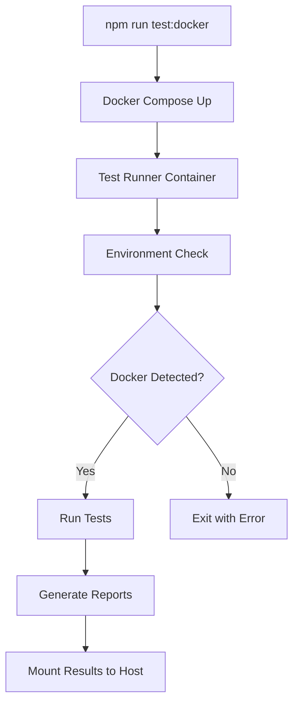

# 🐳 Docker-Only Test Suite

## Overview

The Shipnorth project includes a **Docker-only test suite** that enforces execution within Docker containers to ensure consistent, isolated, and reliable testing environments.

## Why Docker-Only?

### 🛡️ **Environment Isolation**
- **Consistent database state**: PostgreSQL runs in container with predictable data
- **Network isolation**: Container networking prevents host system interference  
- **Dependency management**: All required services (API, Web, DB) guaranteed available
- **Resource isolation**: Container limits prevent tests from affecting host system

### 🔒 **Reliability Benefits**
- **Eliminates "works on my machine"** syndrome
- **Prevents host system configuration issues**
- **Ensures consistent test data state**
- **Provides reproducible test results**

## 🚫 Local Execution Prevention

The Docker-only test suite **automatically refuses to run locally** and provides clear guidance:

```bash
# ❌ This will fail with helpful error message:
npx playwright test -c playwright-docker-only.config.ts

# ❌ This will also fail:  
npm run test:docker:critical  # (when run without Docker)
```

### Detection Methods

The system uses multiple detection methods to identify Docker environment:

1. **Environment Variables**: `DOCKER_ENV=true`, `DOCKER_CONTAINER`, etc.
2. **Filesystem Indicators**: `/.dockerenv`, Docker cgroups in `/proc/1/cgroup`
3. **Hostname Patterns**: Container-style hostnames (hex strings, `shipnorth-*`)
4. **Container Metadata**: Docker-specific mount points and directories

## ✅ Correct Usage

### **Primary Commands**
```bash
# Full Docker test suite
npm run test:docker

# Critical tests only (faster)
npm run test:docker:critical  

# Full suite with all projects
npm run test:docker:full

# Build test runner image (first time or after changes)
npm run test:docker:build
```

### **Docker Environment Setup**
```bash
# 1. Ensure main services are running
npm run dev

# 2. Build test runner (first time)
npm run test:docker:build

# 3. Run tests
npm run test:docker
```

## 🏗️ Docker Test Architecture

### **Test Runner Service**
```yaml
test-runner:
  build: docker/Dockerfile.tests
  environment:
    - DOCKER_ENV=true  # Key enforcement variable
  network_mode: host   # Access localhost services
  profiles: [testing]  # On-demand activation
```

### **Test Configuration**
- **Config File**: `playwright-docker-only.config.ts`
- **Environment Check**: Runs before any tests
- **Projects**: Docker-optimized execution order
- **Output**: `test-artifacts-docker/` directory

### **Enforcement Points**
1. **Global Setup**: `tests/utils/docker-global-setup.ts`
2. **Config Import**: `playwright-docker-only.config.ts`
3. **Wrapper Script**: `tests/docker-test-wrapper.sh`
4. **Individual Tests**: Can call `DockerEnvironmentChecker.enforceDockerOnly()`

## 📊 Test Execution Flow



## 🔧 Local Development Testing

For **local development** (non-Docker), use these commands instead:

```bash
# Local environment tests
npm run test:local

# Development environment tests  
npm run test:dev

# Specific test files
npm run test:auth
npm run test:staff
npm run test:customer

# Quick verification
npm run test:infrastructure
```

## 🛠️ Debugging Docker Tests

### **View Test Results**
```bash
# HTML report (auto-generated)
open test-reports/docker-html-report/index.html

# Live scoreboard (if using scoreboard runner)
open live-scoreboard.html

# Test artifacts
ls test-artifacts-docker/
```

### **Debug Failed Tests**
```bash
# Run with headed browser (visible)
docker-compose --profile testing run --rm test-runner \
  ./tests/docker-test-wrapper.sh \
  npx playwright test -c playwright-docker-only.config.ts --headed

# Run specific test
docker-compose --profile testing run --rm test-runner \
  ./tests/docker-test-wrapper.sh \
  npx playwright test -c playwright-docker-only.config.ts auth.spec.ts
```

### **Container Logs**
```bash
# Check test runner logs
docker-compose --profile testing logs test-runner

# Check main application logs  
docker-compose logs shipnorth
```

## 🎯 Best Practices

### **When to Use Docker Tests**
- ✅ **CI/CD pipelines**: Always use Docker tests
- ✅ **Pre-deployment verification**: Critical path validation
- ✅ **Integration testing**: Full system validation
- ✅ **Regression testing**: Ensure changes don't break existing functionality

### **When to Use Local Tests**
- ✅ **Development iteration**: Quick feedback during coding
- ✅ **Unit test verification**: Fast component testing
- ✅ **Debug specific issues**: Targeted problem solving

### **Test Organization**
```
tests/
├── e2e/                          # Main test files
├── utils/
│   ├── docker-environment-check.ts  # Detection utility
│   ├── docker-global-setup.ts       # Docker setup
│   └── ...other utilities
├── docker-test-wrapper.sh       # Wrapper script
└── DOCKER-ONLY-TESTS.md        # This documentation
```

## 🎉 Benefits Achieved

- **🔒 Zero Local Execution**: Impossible to accidentally run Docker tests locally
- **📋 Clear Error Messages**: Helpful guidance when enforcement triggers
- **🚀 Optimized Performance**: Docker-specific timeout and retry settings
- **🧪 Reliable Results**: Consistent environment eliminates flaky tests
- **🔧 Easy Debugging**: Clear separation between Docker and local test paths

The Docker-only enforcement ensures your test suite maintains the highest reliability and consistency standards! 🚢